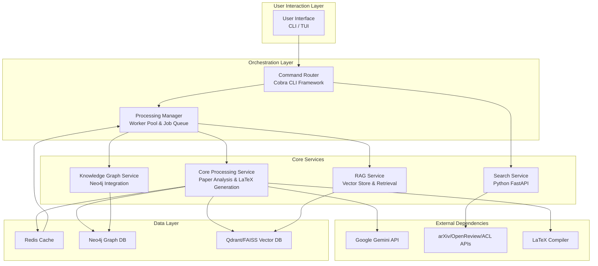
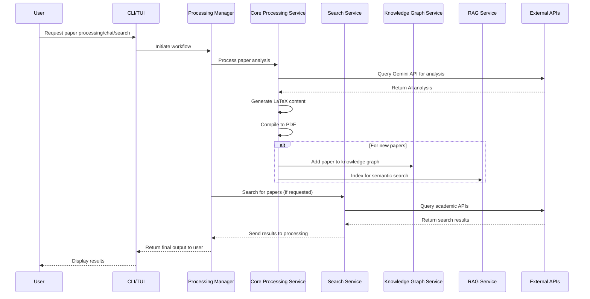
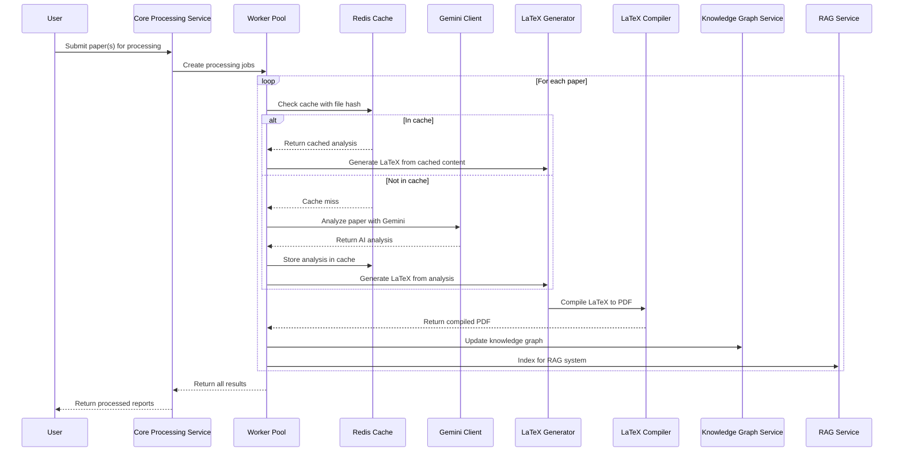
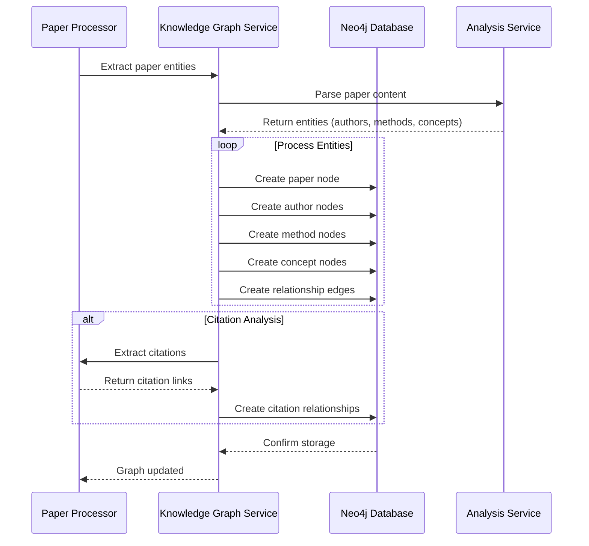
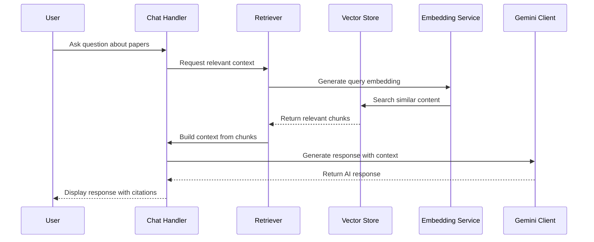
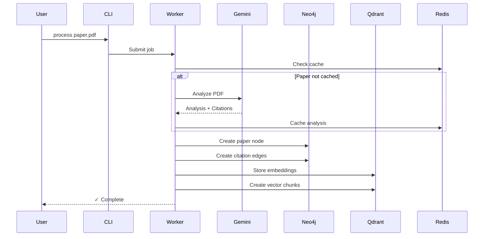
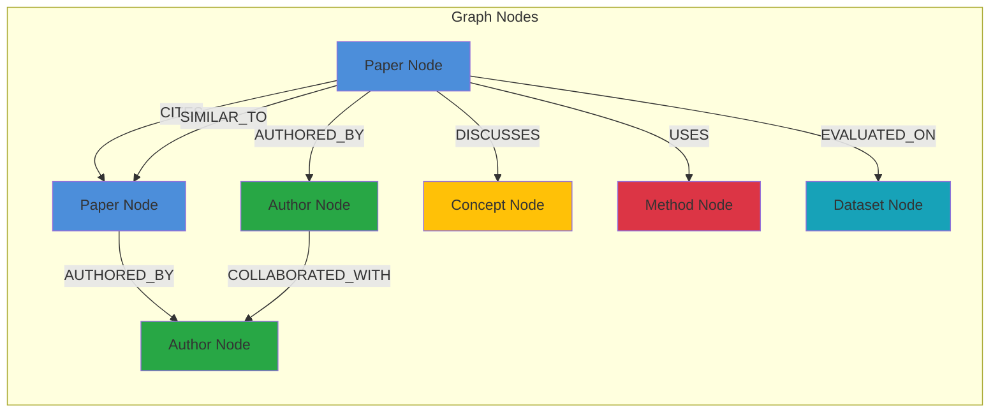

# Archivist - Advanced Research Paper Processing & Analysis Platform

<div align="center">

**Transform AI/ML research papers into student-friendly LaTeX reports using Gemini AI**  
*A comprehensive platform for academic paper analysis, knowledge graph building, and interactive Q&A*

- 🎨 **Interactive TUI**: Beautiful terminal interface for browsing and processing papers
- 🤖 **AI-Powered Analysis**: Uses Google Gemini API with agentic workflows for deep paper analysis
- 📚 **Student-Friendly**: Generates detailed explanations targeted at CS students
- ⚡ **Parallel Processing**: Process multiple papers concurrently with worker pools
- 🔄 **Smart Deduplication**: MD5 hashing prevents reprocessing of papers
- 📝 **LaTeX Output**: Generates professional LaTeX documents and compiles to PDF
- 🎯 **Multi-Stage Analysis**: Optional agentic workflow with self-reflection and refinement
- 📊 **Progress Tracking**: Real-time logging and status monitoring
- ☸️ **Kubernetes Ready**: Production-ready Kubernetes deployment with autoscaling
- 🔍 **Knowledge Graph**: Neo4j-based citation network and semantic search
- 🔎 **Academic Search**: Integrated search across arXiv, OpenReview, and ACL

## 📦 Deployment Options

### 🖥️ Local Deployment
Perfect for single-user, development, or small-scale usage.
- **Setup Time**: ~5 minutes with bootstrap script
- **Resource Usage**: Minimal (runs on laptop)
- **Best For**: Personal use, development, testing

### ☸️ Kubernetes Deployment (Local/Offline)
**Scalable deployment on your personal machine** - not for cloud!
- **Setup Time**: ~10 minutes
- **Resource Usage**: Your laptop (4+ CPU cores, 8GB+ RAM recommended)
- **Best For**: Learning Kubernetes, local autoscaling, personal use
- **Features**: Automatic scaling (1-4 workers), resource management, offline operation
- **Platforms**: Minikube, Kind, Docker Desktop

**→ [Local Kubernetes Guide](docs/KUBERNETES_LOCAL_DEPLOYMENT.md)**

Quick Local Kubernetes Deploy:
```bash
# One-command setup for local Kubernetes
./scripts/k8s-local-setup.sh

# Automatically detects Minikube/Kind/Docker Desktop
# Sets up autoscaling (1-4 workers based on CPU/memory)
# All data stored locally on your machine

# Manage your deployment
./scripts/k8s-manage.sh status
./scripts/k8s-manage.sh scale archivist-worker 4
```

**Why Kubernetes locally?**
- ✅ Automatic scaling based on workload
- ✅ Better resource management
- ✅ Learn Kubernetes hands-on
- ✅ Completely offline after setup
>>>>>>> 4af2a73 (Added kubernetes,hadnt tested yet tho)

</div>

---

## 🚀 Executive Summary

**Archivist** is a sophisticated, multi-service platform that leverages Google Gemini AI to transform complex AI/ML research papers into comprehensive, student-friendly LaTeX reports. The system provides advanced features including knowledge graph creation, semantic search, and interactive Q&A capabilities, making cutting-edge research accessible to students and researchers.

### Key Value Propositions
- **AI-Powered Analysis**: Deep paper analysis using Gemini's multimodal capabilities
- **Academic Accessibility**: Converts complex research into student-friendly explanations
- **Scalable Architecture**: Microservices-based design with parallel processing
- **Knowledge Management**: Integrated knowledge graphs and semantic search
- **Interactive Experience**: Terminal UI with chat, search, and processing workflows

---

## 🏗️ Architecture Overview

### System Architecture



### Project Structure

```
├── cmd/
│   └── main/
│       ├── main.go
│       └── commands/
│           ├── root.go          # Root command and CLI setup
│           ├── process.go       # Paper processing command
│           ├── list.go          # List papers command
│           ├── search.go        # Search papers command
│           ├── cache.go         # Cache management command
│           ├── chat.go          # Chat with papers command
│           ├── models.go        # Gemini models command
│           ├── index.go         # Index papers for chat command
│           └── other commands...
├── config/
│   └── config.yaml             # Configuration file
├── internal/
│   ├── analyzer/              # AI paper analysis
│   │   ├── analyzer.go        # Main analyzer logic
│   │   ├── gemini_client.go   # Gemini API client
│   │   └── prompts.go         # AI prompts
│   ├── app/                   # Application configuration
│   │   ├── config.go          # Configuration parsing
│   │   └── logger.go          # Logging setup
│   ├── cache/                 # Caching system
│   │   └── redis_cache.go     # Redis caching implementation
│   ├── chat/                  # Chat system
│   │   └── chat_engine.go     # Chat engine logic
│   ├── compiler/              # LaTeX compilation
│   │   └── latex_compiler.go  # LaTeX to PDF compilation
│   ├── generator/             # LaTeX generation
│   │   └── latex_generator.go # LaTeX file creation
│   ├── graph/                 # Knowledge graph
│   │   ├── builder.go         # Graph builder base
│   │   ├── enhanced_neo4j_builder.go # Enhanced Neo4j operations
│   │   ├── citation_extractor.go # Citation extraction
│   │   ├── enhanced_builder.go # Enhanced builder logic
│   │   ├── enhanced_models.go # Graph models
│   │   ├── hybrid_search.go   # Hybrid graph/vector search
│   │   ├── models.go          # Graph models
│   │   └── various graph components...
│   ├── parser/                # PDF parsing (uses Gemini vision)
│   ├── profiler/              # Performance profiling
│   │   └── profiler.go        # CPU/Memory profiling
│   ├── python_rag/            # Python RAG components
│   ├── rag/                   # RAG system
│   │   ├── chunker.go         # Text chunking
│   │   ├── embeddings.go      # Embedding client
│   │   ├── faiss_store.go     # FAISS vector store
│   │   ├── indexer.go         # Index management
│   │   ├── retriever.go       # Context retrieval
│   │   ├── vector_store_interface.go # Vector store interface
│   │   ├── vector_store.go    # Vector store logic
│   │   └── direct_indexer.go  # Direct indexing
│   ├── search/                # Search client
│   │   └── client.go          # Python search client
│   ├── tui/                   # Terminal UI
│   │   ├── chat.go            # Chat UI
│   │   ├── chat_handlers.go   # Chat handlers
│   │   ├── chat_indexing.go   # Chat indexing
│   │   ├── command_palette.go # Command palette
│   │   ├── handlers.go        # UI handlers
│   │   ├── loaders.go         # Loading indicators
│   │   ├── model.go           # TUI model
│   │   ├── navigation.go      # Navigation logic
│   │   ├── search.go          # Search UI
│   │   ├── styles.go          # UI styling
│   │   ├── types.go           # TUI types
│   │   └── views.go           # UI views
│   ├── ui/                    # UI utilities
│   │   └── ui.go              # UI helper functions
│   ├── vectorstore/           # Vector store
│   ├── wizard/                # Setup wizard
│   └── worker/                # Processing workers
│       └── pool.go            # Worker pool logic
├── pkg/
│   └── fileutil/              # File utilities
│       ├── hash.go            # File hashing
│       └── hash_test.go       # Hash tests
├── services/                  # External services
│   └── search-engine/         # Python search service
├── scripts/                   # Helper scripts
├── tex_files/                 # Generated LaTeX files
├── reports/                   # Generated PDF reports
├── lib/                       # Input PDF library
└── various configuration and build files
```

### Technology Stack

| Category | Technologies |
|----------|--------------|
| **Backend** | Go 1.24+ (Golang) |
| **AI/ML** | Google Gemini API, Vision, Embeddings |
| **Databases** | Neo4j (Graph), Redis (Cache), Qdrant/FAISS (Vector) |
| **Frontend** | Bubble Tea (Terminal UI), Charm Bracelet ecosystem |
| **Web Framework** | FastAPI (Python Search Service) |
| **Search** | arXiv API, OpenReview API, ACL API |
| **Compilers** | LaTeX (pdflatex, xelatex, latexmk) |
| **Infrastructure** | Docker, Docker Compose, gRPC |
| **CLI** | Cobra Framework |
| **Configuration** | Viper, YAML |

---

## 🎯 Core Features & Components

### 1. Command-Line Interface (CLI)

#### Root Command (`cmd/main/commands/root.go`)
Handles the main CLI structure and subcommands

```go
func NewRootCommand() *cobra.Command {
    rootCmd := &cobra.Command{
        Use:   "rph",
        Short: "Research Paper Helper - Convert research papers to student-friendly LaTeX reports",
        Long: `Research Paper Helper analyzes AI/ML research papers using Gemini AI
and generates comprehensive, student-friendly LaTeX reports with detailed
explanations of methodologies, breakthroughs, and results.`,
    }

    // Add all subcommands
    rootCmd.AddCommand(
        NewProcessCommand(),
        NewListCommand(),
        NewStatusCommand(),
        NewCleanCommand(),
        NewCheckCommand(),
        NewRunCommand(),
        NewModelsCommand(),
        NewCacheCommand(),
        NewConfigureCommand(),
        NewChatCommand(),
        NewIndexCommand(),
        NewSearchCommand(),
    )
    return rootCmd
}
```

#### Process Command (`cmd/main/commands/process.go`)
Handles paper processing with parallel workers

**Functions:**
- `NewProcessCommand()` - Creates the process command
- `runProcess()` - Main processing logic
- `applyModeConfig()` - Applies processing mode configuration

**Key Features:**
- Parallel processing with configurable workers
- Interactive mode selection
- Dependency checking
- Redis caching integration
- RAG indexing option

#### Other CLI Commands
- **List Command**: Displays input PDFs or generated reports
- **Search Command**: Searches for academic papers across multiple sources
- **Cache Command**: Manages Redis analysis cache
- **Chat Command**: Interactive Q&A with papers using RAG
- **Models Command**: Lists available Gemini AI models
- **Index Command**: Indexes processed papers for chat functionality

### 2. Core Application Components

#### App Configuration (`internal/app/config.go`)

**Structs:**
- `Config` - Main configuration structure
- `ProcessingConfig` - Processing settings
- `GeminiConfig` - Gemini AI settings
- `AgenticConfig` - Agentic workflow settings
- `StagesConfig` - Multi-stage analysis settings
- `StageConfig` - Individual stage settings
- `RetryConfig` - Retry logic settings
- `LatexConfig` - LaTeX compilation settings
- `LoggingConfig` - Logging configuration
- `CacheConfig` - Caching configuration
- `RedisConfig` - Redis connection settings
- `FAISSConfig` - FAISS settings
- `GraphConfig` - Graph database settings
- `Neo4jConfig` - Neo4j connection settings
- `CitationExtractionConfig` - Citation settings
- `SearchConfig` - Search settings
- `OptimizationConfig` - Optimization settings
- `VisualizationConfig` - Visualization settings
- `TerminalVisualizationConfig` - Terminal visualization
- `WebVisualizationConfig` - Web visualization

**Functions:**
- `LoadConfig(configPath string) (*Config, error)` - Loads configuration from YAML and .env
- `validateConfig(config *Config) error` - Validates configuration values
- `ensureDirectories(config *Config) error` - Creates required directories

### 3. Paper Processing Pipeline

#### Worker Pool (`internal/worker/pool.go`)

**Structs:**
- `ProcessingJob` - Represents a processing job
- `ProcessingResult` - Represents processing result
- `WorkerPool` - Manages worker pool

**Functions:**
- `NewWorkerPool(numWorkers int, config *app.Config, redisCache *cache.RedisCache) *WorkerPool` - Creates new worker pool
- `SetEnableRAG(enable bool)` - Sets RAG indexing flag
- `Start(ctx context.Context)` - Starts worker pool
- `worker(ctx context.Context, id int)` - Individual worker process
- `processJob(ctx context.Context, job *ProcessingJob) *ProcessingResult` - Processes individual PDF
- `SubmitJob(job *ProcessingJob)` - Submits job to pool
- `Close()` - Closes job channel
- `Wait()` - Waits for workers to finish
- `Results()` - Returns results channel
- `ProcessBatch(ctx context.Context, files []string, config *app.Config, force bool, enableRAG bool) error` - Processes batch of files
- `extractTitleFromLatex(latexContent string) string` - Extracts paper title from LaTeX

#### Paper Indexing (`internal/worker/indexing.go`)
Handles RAG indexing for processed papers

**Functions:**
- `IndexPaperAfterProcessing(ctx context.Context, config *app.Config, paperTitle, latexContent, pdfPath string) error` - Indexes paper after processing

### 4. AI Integration

#### Analyzer (`internal/analyzer/analyzer.go`)

**Structs:**
- `Analyzer` - Main analyzer structure

**Functions:**
- `NewAnalyzer(config *app.Config) (*Analyzer, error)` - Creates new analyzer
- `Close() error` - Closes analyzer
- `GetClient() *GeminiClient` - Returns Gemini client
- `AnalyzePaper(ctx context.Context, pdfPath string) (string, error)` - Multi-stage paper analysis
- `simplAnalysis(ctx context.Context, pdfPath string) (string, error)` - Simple analysis
- `agenticAnalysis(ctx context.Context, pdfPath string) (string, error)` - Agentic analysis
- `validateLatexSyntax(ctx context.Context, latexContent string) (string, error)` - Syntax validation
- `cleanLatexOutput(content string) string` - Cleans LaTeX output

#### Gemini Client (`internal/analyzer/gemini_client.go`)

**Structs:**
- `GeminiClient` - Gemini API client

**Functions:**
- `NewGeminiClient(apiKey, model string, temperature float64, maxTokens int) (*GeminiClient, error)` - Creates new client
- `Close() error` - Closes client connection
- `GenerateText(ctx context.Context, prompt string) (string, error)` - Generates text from prompt
- `AnalyzePDFWithVision(ctx context.Context, pdfPath, prompt string) (string, error)` - Multimodal PDF analysis
- `GenerateWithRetry(ctx context.Context, prompt string, maxAttempts int, backoffMultiplier int, initialDelayMs int) (string, error)` - Retry logic for generation
- `ListAvailableModels(ctx context.Context) ([]string, error)` - Lists available models
- `FindThinkingModel(ctx context.Context) (string, error)` - Finds best thinking model

#### Prompts (`internal/analyzer/prompts.go`)

**Constants:**
- `AnalysisPrompt` - Main prompt for paper analysis
- `SyntaxValidationPrompt` - Prompt for LaTeX syntax validation

### 5. Knowledge Graph System

#### Graph Builder (`internal/graph/builder.go`)

**Structs:**
- `GraphConfig` - Graph configuration
- `GraphBuilder` - Graph builder base
- `PaperNode` - Paper node structure
- `AuthorNode` - Author node structure
- `InstitutionNode` - Institution node structure
- `ConceptNode` - Concept node structure
- `MethodNode` - Method node structure
- `VenueNode` - Venue node structure
- `DatasetNode` - Dataset node structure
- `CitationRelationship` - Citation relationship
- `AuthorshipRelationship` - Authorship relationship
- `AffiliationRelationship` - Affiliation relationship
- `UsesMethodRelationship` - Method usage relationship
- `PublishedInRelationship` - Publication relationship
- `CoAuthorshipRelationship` - Co-authorship relationship
- `UsesDatasetRelationship` - Dataset usage relationship
- `ExtendsRelationship` - Extension relationship
- `GraphStats` - Graph statistics
- `AuthorImpact` - Author impact metrics
- `CollaborationNetwork` - Collaboration network

**Functions:**
- `NewGraphBuilder(config *GraphConfig) (*GraphBuilder, error)` - Creates new graph builder
- `Close(ctx context.Context)` - Closes graph connection
- `InitializeSchema(ctx context.Context)` - Initializes schema
- `AddPaper(ctx context.Context, paper *PaperNode)` - Adds paper node
- `AddAuthor(ctx context.Context, author *AuthorNode)` - Adds author node
- `AddInstitution(ctx context.Context, inst *InstitutionNode)` - Adds institution node
- `AddConcept(ctx context.Context, concept *ConceptNode)` - Adds concept node
- `AddMethod(ctx context.Context, method *MethodNode)` - Adds method node
- `AddVenue(ctx context.Context, venue *VenueNode)` - Adds venue node
- `AddDataset(ctx context.Context, dataset *DatasetNode)` - Adds dataset node
- `LinkPaperToCitation(ctx context.Context, rel *CitationRelationship)` - Links papers via citations
- `GetStats(ctx context.Context) (*GraphStats, error)` - Gets graph statistics

### 6. RAG & Chat System

#### Embeddings (`internal/rag/embeddings.go`)

**Constants:**
- `EmbeddingModel` - Default embedding model
- `EmbeddingDimensions` - Embedding dimension size

**Structs:**
- `EmbeddingClient` - Embedding client structure

**Functions:**
- `NewEmbeddingClient(apiKey string) (*EmbeddingClient, error)` - Creates embedding client
- `Close() error` - Closes embedding client
- `GenerateEmbedding(ctx context.Context, text string) ([]float32, error)` - Generates single embedding
- `GenerateBatchEmbeddings(ctx context.Context, texts []string) ([][]float32, error)` - Generates batch embeddings

#### FAISS Vector Store (`internal/rag/faiss_store.go`)

**Structs:**
- `FAISSVectorStore` - FAISS vector store
- `VectorDocument` - Vector document structure
- `SearchResult` - Search result structure

**Functions:**
- `NewFAISSVectorStore(indexDir string) (*FAISSVectorStore, error)` - Creates FAISS store
- `AddDocument(ctx context.Context, doc VectorDocument) error` - Adds document
- `AddDocuments(ctx context.Context, docs []VectorDocument) error` - Adds multiple documents
- `Search(ctx context.Context, queryEmbedding []float32, topK int, filter map[string]string) ([]SearchResult, error)` - Vector search
- `SearchBySource(ctx context.Context, queryEmbedding []float32, source string, topK int) ([]SearchResult, error)` - Source-specific search
- `GetDocumentsBySource(ctx context.Context, source string) ([]VectorDocument, error)` - Gets documents by source
- `DeleteBySource(ctx context.Context, source string) (int, error)` - Deletes by source
- `save() error` - Saves index to disk
- `load() error` - Loads index from disk
- `GetStats() map[string]interface{}` - Gets statistics
- `GetIndexedPapers() []string` - Gets indexed paper titles
- `cosineSimilarity(a, b []float32) float32` - Calculates cosine similarity

#### Chat Engine (`internal/chat/chat_engine.go`)

**Constants:**
- `ChatHistoryPrefix` - Redis key prefix for chat histories
- `ChatHistoryTTL` - TTL for chat histories

**Structs:**
- `Message` - Chat message structure
- `ChatSession` - Chat session structure
- `ChatEngine` - Chat engine structure

**Functions:**
- `NewChatEngine(retriever *rag.Retriever, geminiClient *analyzer.GeminiClient, redisClient *redis.Client) *ChatEngine` - Creates chat engine
- `StartSession(ctx context.Context, paperTitles []string) (*ChatSession, error)` - Starts chat session
- `Chat(ctx context.Context, session *ChatSession, userMessage string) (*Message, error)` - Processes chat message
- `GetSession(ctx context.Context, sessionID string) (*ChatSession, error)` - Gets session
- `ListSessions(ctx context.Context) ([]*ChatSession, error)` - Lists sessions
- `DeleteSession(ctx context.Context, sessionID string) error` - Deletes session
- `ExportSessionToLatex(session *ChatSession) string` - Exports session to LaTeX
- `saveSession(ctx context.Context, session *ChatSession) error` - Saves session
- `buildPrompt(session *ChatSession, userMessage string, context *rag.RetrievedContext) string` - Builds RAG prompt
- `extractCitations(context *rag.RetrievedContext) []string` - Extracts citations
- `truncateString(s string, maxLen int) string` - Truncates string
- `escapeLatex(text string) string` - Escapes LaTeX characters
- `replaceAll(s, old, new string) string` - Replaces all occurrences

### 7. Search Engine Microservice

#### Search Client (`internal/search/client.go`)

**Structs:**
- `Client` - Search client structure
- `SearchQuery` - Search query structure
- `SearchResult` - Search result structure
- `SearchResponse` - Search response structure
- `DownloadRequest` - Download request structure
- `DownloadResponse` - Download response structure
- `HealthResponse` - Health check response structure

**Functions:**
- `NewClient(baseURL string) *Client` - Creates search client
- `Search(query *SearchQuery) (*SearchResponse, error)` - Performs search
- `DownloadPaper(pdfURL, filename string) (*DownloadResponse, error)` - Downloads paper
- `HealthCheck() (*HealthResponse, error)` - Health check
- `IsServiceRunning() bool` - Checks if service is running

### 8. Terminal UI

#### TUI Model (`internal/tui/model.go`)

**Structs:**
- `Model` - Main TUI model
- `screen` - Screen enumeration
- `item` - List item structure
- `command` - Command structure

**Functions:**
- `InitialModel(configPath string) (*Model, error)` - Creates initial model
- `Init() tea.Cmd` - Initialization command
- `Update(msg tea.Msg) (tea.Model, tea.Cmd)` - Updates model
- `executeCommand(action string) (tea.Model, tea.Cmd)` - Executes command
- `Run(configPath string) error` - Runs TUI
- `handleBatchProcessing(config *app.Config) error` - Handles batch processing
- `handleMultiplePapersProcessing(selectedPapers []string, config *app.Config) error` - Handles multiple paper processing
- `handleSinglePaperProcessing(selectedPaper string, config *app.Config) error` - Handles single paper processing
- `handleOpenPDF(pdfPath string) error` - Opens PDF
- `handleProcessAndChat(pdfPath string, config *app.Config) error` - Processes and chats

### 9. Caching System

#### Redis Cache (`internal/cache/redis_cache.go`)

**Structs:**
- `CachedAnalysis` - Cached analysis structure
- `RedisCache` - Redis cache structure

**Functions:**
- `NewRedisCache(addr, password string, db int, ttl time.Duration) (*RedisCache, error)` - Creates Redis cache
- `Close() error` - Closes Redis connection
- `Get(ctx context.Context, contentHash string) (*CachedAnalysis, error)` - Gets cached analysis
- `Set(ctx context.Context, contentHash string, analysis *CachedAnalysis) error` - Sets cached analysis
- `Clear(ctx context.Context) (int64, error)` - Clears all cache
- `GetStats(ctx context.Context) (int64, error)` - Gets cache statistics
- `Exists(ctx context.Context, contentHash string) (bool, error)` - Checks if exists
- `Delete(ctx context.Context, contentHash string) error` - Deletes entry
- `ListAll(ctx context.Context) ([]*CachedAnalysis, error)` - Lists all entries

---

## 🎨 User Experience Features

### Interactive TUI Workflows



### Core Processing Service Workflow



### Knowledge Graph Service Workflow



### RAG Service Workflow



---

## 📄 LaTeX Output Structure

Generated reports follow this template:

```latex
\documentclass[11pt,a4paper]{article}

% Packages: amsmath, hyperref, tcolorbox, etc.

\newtcolorbox{keyinsight}{...}      % Blue highlight boxes
\newtcolorbox{prerequisite}{...}    % Green prerequisite boxes

\section{Executive Summary}
\section{Problem Statement}
\section{Methods Overview}
\section{Detailed Methodology}
  \subsection{Prerequisites}
  \subsection{Architecture and Approach}
  \subsection{Mathematical Formulations}
\section{The Breakthrough}
\section{Experimental Setup}
\section{Results and Improvements}
\section{Conclusion and Impact}
```

### Key Features:
- Student-friendly language
- Specific prerequisites (not vague)
- Math explained with context
- Quantitative results with numbers
- Visual highlight boxes (key insights)

---

## 🛠️ Quick Start Guide

### Option 1: Automated Setup (Recommended - From Scratch)

**Perfect for first-time users!** This will automatically install ALL dependencies:

```bash
# Clone the repository
git clone https://github.com/shyan/Archivist.git
cd Archivist

# Run automated bootstrap (checks & installs everything)
./scripts/bootstrap.sh

# Or use the Go command (after first build)
./archivist setup

# What gets installed automatically:
# ✓ Go 1.21+ (if not present)
# ✓ Python 3.8+ (if not present)
# ✓ Docker & Docker Compose (if not present)
# ✓ LaTeX (texlive-latex-extra, latexmk)
# ✓ Git, Make, and build tools
# ✓ All Go module dependencies
# ✓ Python virtual environment and packages
# ✓ Docker images: Neo4j, Qdrant, Redis, Kafka
# ✓ Project directories and configuration files
# ✓ Compiled Archivist binary
```

The bootstrap script will:
- 🔍 Check for existing installations
- 📦 Install only missing dependencies
- ⏱️ Show progress with loading indicators
- ✅ Verify all services are working
- 📖 Provide next steps guidance

**Just one command from zero to fully working!**

### Option 2: Manual Installation

If you prefer manual control:

```bash
# 1. Clone the repository
git clone https://github.com/shyan/Archivist.git
cd Archivist

# 2. Install system dependencies
# For Ubuntu/Debian:
sudo apt-get update
sudo apt-get install -y golang python3 python3-pip docker.io docker-compose \
                        texlive-latex-extra latexmk git build-essential

# For macOS:
brew install go python3 docker docker-compose mactex git

# 3. Set up your API key
echo "GEMINI_API_KEY=your_api_key_here" > .env

# 4. Install Go dependencies
go mod download
go mod tidy

# 5. Build the application
go build -o archivist ./cmd/main

# 6. Set up Python search engine (optional)
cd services/search-engine
python3 -m venv venv
source venv/bin/activate
pip install -r requirements.txt
cd ../..

# 7. Start Docker services for Knowledge Graph (optional)
docker-compose -f docker-compose-graph.yml up -d
```

### Prerequisites Check

Before starting, verify you have:

```bash
# Check Go version (1.21+ required)
go version

# Check Python version (3.8+ required)
python3 --version

# Check Docker
docker --version
docker-compose --version

# Check LaTeX
pdflatex --version
latexmk --version

# Get Gemini API Key from:
# https://aistudio.google.com/app/apikey
```

### Interactive Usage (Recommended)
```bash
# Launch the beautiful terminal interface
./archivist run

# Navigate with arrow keys or vim-style shortcuts (j/k)
# Process papers, chat, search, and manage settings
```

### Command Line Usage
```bash
# Process a single PDF
./archivist process lib/paper.pdf

# Process all PDFs in a directory with parallel workers
./archivist process lib/ --parallel 8

# Search for academic papers across multiple sources
./archivist search "transformer architecture"

# Chat with processed papers
./archivist chat

# List processed papers
./archivist list

# Check processing status
./archivist status lib/paper.pdf

# Manage cache
./archivist cache stats  # Show cache statistics
./archivist cache clear # Clear all cached analyses
```

---

## 🔧 Configuration Schema

```yaml
processing:
  max_workers: 4
  batch_size: 5
  timeout_per_paper: 600

gemini:
  model: "gemini-2.0-flash"
  max_tokens: 8000
  temperature: 0.3

  agentic:
    enabled: true
    max_iterations: 3
    self_reflection: true
    multi_stage_analysis: true

    stages:
      metadata_extraction:
        model: "gemini-2.0-flash"
        temperature: 1

      methodology_analysis:
        model: "gemini-2.5-pro"
        temperature: 1
        thinking_budget: 10000

      latex_generation:
        model: "gemini-2.0-flash"
        temperature: 1
        validation: true

    retry:
      max_attempts: 3
      backoff_multiplier: 2
      initial_delay_ms: 1000

latex:
  compiler: "pdflatex"
  engine: "latexmk"
  clean_aux: true

logging:
  level: "info"
  file: ".metadata/processing.log"
  console: true
```

---

## 🧠 Knowledge Graph Database Setup (Detailed Guide)

The Knowledge Graph is an advanced feature that creates a semantic network of research papers, enabling powerful search and discovery capabilities.

### Architecture Overview

```mermaid
graph TB
    subgraph "Archivist Core"
        CLI[CLI Commands]
        Core[Core Processing]
    end

    subgraph "Knowledge Graph Stack"
        Neo4j[(Neo4j<br/>Graph Database)]
        Qdrant[(Qdrant<br/>Vector Database)]
        Redis[(Redis<br/>Cache Layer)]
        Kafka[Kafka<br/>Message Broker]
    end

    subgraph "Services"
        GraphSvc[Graph Service<br/>Python]
        SearchSvc[Search Service<br/>Python]
    end

    CLI --> Core
    Core --> Neo4j
    Core --> Qdrant
    Core --> Redis
    Core --> Kafka
    Kafka --> GraphSvc
    GraphSvc --> Neo4j
    GraphSvc --> Qdrant
    SearchSvc --> Redis

    style Neo4j fill:#4c8eda
    style Qdrant fill:#dc3545
    style Redis fill:#d82c20
    style Kafka fill:#231f20
```



### Data Flow Diagram



### Step 1: Start Graph Services

**Option A: Using Helper Script (Easiest)**

```bash
# Start all services with health checks
./scripts/setup_graph_services.sh start

# This will:
# ✓ Start Neo4j on ports 7474 (HTTP) and 7687 (Bolt)
# ✓ Start Qdrant on ports 6333 (HTTP) and 6334 (gRPC)
# ✓ Start Redis on port 6379
# ✓ Start Kafka on ports 9092 and 9094
# ✓ Wait for all services to be healthy
# ✓ Show access URLs
```

**Option B: Using Docker Compose Directly**

```bash
# Start services in background
docker-compose -f docker-compose-graph.yml up -d

# View logs
docker-compose -f docker-compose-graph.yml logs -f

# Check status
docker-compose -f docker-compose-graph.yml ps
```

**Option C: Start During Bootstrap**

```bash
# The bootstrap script will ask if you want to start services
./scripts/bootstrap.sh
# Answer 'y' when prompted
```

### Step 2: Verify Services Are Running

```bash
# Check all services
./scripts/setup_graph_services.sh status

# Or test connections
./scripts/setup_graph_services.sh test

# Expected output:
# ✓ Neo4j: Connected
# ✓ Qdrant: Connected
# ✓ Redis: Connected
# ✓ Kafka: Connected
```

**Manual verification:**

```bash
# Neo4j (should return "1")
docker exec archivist-neo4j cypher-shell -u neo4j -p password "RETURN 1"

# Qdrant (should return "ok")
curl http://localhost:6333/healthz

# Redis (should return "PONG")
docker exec archivist-redis redis-cli ping

# Kafka
docker exec archivist-kafka kafka-broker-api-versions.sh --bootstrap-server localhost:9092
```

### Step 3: Configure Archivist for Graph

Edit `config/config.yaml`:

```yaml
# Enable knowledge graph
graph:
  enabled: true                    # IMPORTANT: Set to true

  # Neo4j connection
  neo4j:
    uri: "bolt://localhost:7687"
    username: "neo4j"
    password: "password"
    database: "archivist"

  # Citation extraction
  citation_extraction:
    enabled: true
    prioritize_in_text: true
    confidence_threshold: 0.7

  # Hybrid search weights
  search:
    vector_weight: 0.5             # 50% from embeddings
    graph_weight: 0.3              # 30% from graph
    keyword_weight: 0.2            # 20% from keywords

# Qdrant vector database
qdrant:
  host: "localhost"
  port: 6333
  collection_name: "archivist_papers"
  use_grpc: true

# Redis cache
cache:
  enabled: true
  type: "redis"
  redis:
    addr: "localhost:6379"
    password: ""
    db: 0
```

### Step 4: Build the Knowledge Graph

```bash
# Process papers and build graph automatically
./archivist process lib/*.pdf

# The graph is built automatically during processing!
# Each paper creates:
# • Paper node in Neo4j
# • Author nodes and relationships
# • Citation relationships
# • Concept nodes
# • Vector embeddings in Qdrant
```

**Check graph statistics:**

```bash
./archivist graph stats

# Output:
# Papers: 25
# Authors: 143
# Citations: 487
# Concepts: 89
```

### Step 5: Use the Knowledge Graph

**Semantic Search:**

```bash
# Search using hybrid algorithm
./archivist search "attention mechanisms in transformers"

# Results combine:
# • Vector similarity (Qdrant embeddings)
# • Graph relationships (Neo4j citations)
# • Keyword matching (full-text search)
```

**Citation Analysis:**

```bash
# Show citation network for a paper
./archivist cite show "Attention Is All You Need"

# Find citation path between papers
./archivist cite path "BERT" "GPT-3"

# Rank papers by citations
./archivist cite rank --top 10
```

**Graph Exploration:**

```bash
# Explore related papers
./archivist explore "ResNet" --depth 2

# Find similar papers
./archivist similar "lib/vit.pdf" --top-k 5

# Get recommendations
./archivist recommend --based-on lib/transformer.pdf
```

### Knowledge Graph Architecture



### Node Types and Properties

**Paper Node:**
```cypher
(:Paper {
  id: "unique-id",
  title: "Attention Is All You Need",
  authors: ["Vaswani", "Shazeer", ...],
  year: 2017,
  venue: "NeurIPS",
  abstract: "...",
  embedding: [0.1, 0.2, ...]
})
```

**Author Node:**
```cypher
(:Author {
  name: "Ashish Vaswani",
  affiliation: "Google Brain",
  h_index: 45,
  papers_count: 23
})
```

**Relationship Types:**
- `CITES` - Paper cites another paper
- `CITED_BY` - Reverse citation
- `AUTHORED_BY` - Paper written by author
- `COLLABORATED_WITH` - Co-authorship
- `DISCUSSES` - Paper discusses concept
- `USES` - Paper uses method
- `SIMILAR_TO` - Semantic similarity
- `EVALUATED_ON` - Uses dataset

### Service Management Commands

```bash
# Start all services
./scripts/setup_graph_services.sh start

# Stop services (keeps data)
./scripts/setup_graph_services.sh stop

# Restart services
./scripts/setup_graph_services.sh restart

# View logs for specific service
./scripts/setup_graph_services.sh logs neo4j

# Check service status
./scripts/setup_graph_services.sh status

# Test all connections
./scripts/setup_graph_services.sh test

# Backup all data
./scripts/setup_graph_services.sh backup

# Clean all data (destructive!)
./scripts/setup_graph_services.sh clean

# Reset (clean + restart)
./scripts/setup_graph_services.sh reset
```

### Access Web Interfaces

Once services are running:

**Neo4j Browser:**
- URL: http://localhost:7474
- Username: `neo4j`
- Password: `password`
- Try: `MATCH (p:Paper) RETURN p LIMIT 10`

**Qdrant Dashboard:**
- URL: http://localhost:6333/dashboard
- View collections, vectors, and search

**Redis:**
- Access via CLI: `docker exec -it archivist-redis redis-cli`
- Or use Redis Desktop Manager

### Troubleshooting

**Services won't start:**

```bash
# Check Docker is running
docker info

# Check port conflicts
sudo lsof -i :7474
sudo lsof -i :6333
sudo lsof -i :6379

# View service logs
docker-compose -f docker-compose-graph.yml logs neo4j
```

**Graph is empty:**

```bash
# Rebuild graph from processed papers
./archivist graph rebuild

# Check if papers are indexed
./archivist graph stats
```

**Search returns no results:**

```bash
# Verify Qdrant collection exists
curl http://localhost:6333/collections

# Re-index papers
./archivist graph reindex
```

**Connection errors:**

```bash
# Verify services are healthy
./scripts/setup_graph_services.sh test

# Check Neo4j connection
docker exec archivist-neo4j cypher-shell -u neo4j -p password "RETURN 1"

# Check Qdrant
curl http://localhost:6333/healthz
```

### Cost Analysis

For 50 papers with Knowledge Graph:

| Component | Cost | Notes |
|-----------|------|-------|
| Gemini Analysis | $0.10 | Paper understanding |
| Citation Extraction | $0.05 | LLM-based extraction |
| Embeddings (500 chunks) | $0.05 | 10 chunks per paper |
| **Neo4j** | **FREE** | Community edition |
| **Qdrant** | **FREE** | Self-hosted |
| **Redis** | **FREE** | Self-hosted |
| **Total** | **$0.20** | For 50 papers! |

### Performance Metrics

**Graph Operations:**
- Node creation: <10ms
- Relationship creation: <5ms
- Citation query: <50ms
- Similarity search: <100ms

**Search Performance:**
- Hybrid search (50 papers): ~150ms
- Pure vector search: ~50ms
- Pure graph search: ~80ms

---

## 📊 Performance Characteristics

### Throughput
- Single paper: ~22.4 seconds 
- Estimated batch (5 papers, 4 workers): ~22.4 seconds


### Resource Usage
- Binary size: 34MB
- Memory: Moderate (handles 4 concurrent workers)
- Disk: Minimal (LaTeX files ~15-20KB, PDFs ~150-200KB)

### Bottlenecks
1. Gemini API latency (dominant factor)
2. LaTeX compilation (2-3 passes)
3. PDF size for multimodal upload

### Optimization Opportunities
- Reduce `max_iterations` for faster processing
- Use `gemini-flash` for all stages (sacrifice quality for speed)
- Disable validation stage
- Increase `max_workers` (respects API rate limits)

---

## 🧠 Advanced Features

### Multi-Stage Agentic Analysis
- **Stage 1**: Methodology analysis with Gemini Pro
- **Stage 2**: Self-reflection and refinement
- **Stage 3**: LaTeX syntax validation and optimization
- **Customizable**: Different models and parameters per stage

### Knowledge Graph Capabilities
- **Entity Extraction**: Papers, authors, institutions, methods, datasets
- **Relationship Building**: Citations, collaborations, method evolution
- **Network Analysis**: Impact metrics, collaboration networks
- **Query Interface**: Rich queries for research patterns and connections

### RAG-Powered Chat System
- **Context Retrieval**: Semantic search across processed papers
- **Session Management**: Persistent chat sessions with history
- **Multi-Paper Queries**: Ask questions spanning multiple research papers
- **Citation Integration**: Responses with proper academic citations

### Academic Search Integration
- **Multi-Source**: arXiv, OpenReview, ACL, and more
- **Intelligent Ranking**: Relevance-based result ordering
- **One-Click Processing**: Direct download and analysis pipeline
- **Metadata Enrichment**: Comprehensive paper metadata extraction

---

## 🤝 Contributing

We welcome contributions to Archivist! Here's how you can help:

### Development Setup
```bash
# Fork the repository
git clone https://github.com/your-username/Archivist.git
cd Archivist

# Set up development environment
go mod tidy
./archivist check  # Verify dependencies

# Run tests
go test ./...
```

### Areas for Contribution
- **Feature Development**: New AI analysis capabilities, UI enhancements
- **Testing**: Expand unit test coverage, integration tests
- **Documentation**: API documentation, user guides, tutorials
- **Performance**: Optimization, memory management, parallel processing
- **New Integrations**: Additional academic sources, AI models, output formats

---

## 📄 License

This project is licensed under the MIT License - see the [LICENSE](LICENSE) file for details.

---

## 🙏 Acknowledgments

### Core Technologies
- [Google Gemini API](https://ai.google.dev/) - Advanced AI capabilities
- [Cobra CLI](https://github.com/spf13/cobra) - CLI framework
- [Viper Config](https://github.com/spf13/viper) - Configuration management
- [Bubble Tea](https://github.com/charmbracelet/bubbletea) - Terminal UI framework
- [Lip Gloss](https://github.com/charmbracelet/lipgloss) - Terminal styling
- [Bubbles](https://github.com/charmbracelet/bubbles) - UI components

### Academic Integration
- [arXiv API](https://arxiv.org/help/api) - Academic paper repository
- [Neo4j](https://neo4j.com/) - Graph database for knowledge management
- [Qdrant](https://qdrant.tech/) - Vector search engine
- [LaTeX Project](https://www.latex-project.org/) - Academic document preparation

---

<div align="center">

**Archivist** - *Making AI/ML research accessible through advanced AI processing*

[Get Started](#-quick-start-guide) • [Features](#-core-features--components) • [Architecture](#-architecture-overview) • [Contribute](#-contributing)

</div>
