# Kubernetes Deployment Guide for Archivist

Complete guide to deploying Archivist on Kubernetes with autoscaling, high availability, and production-ready configuration.

---

## 📋 Table of Contents

1. [Overview](#overview)
2. [Architecture](#architecture)
3. [Prerequisites](#prerequisites)
4. [Quick Start](#quick-start)
5. [Building Docker Images](#building-docker-images)
6. [Deployment](#deployment)
7. [Autoscaling Configuration](#autoscaling-configuration)
8. [Monitoring & Management](#monitoring--management)
9. [Production Considerations](#production-considerations)
10. [Troubleshooting](#troubleshooting)

---

## Overview

The Kubernetes deployment provides:

✅ **Horizontal Autoscaling** - Automatically scale workers based on CPU/memory
✅ **High Availability** - Multiple replicas with load balancing
✅ **Persistent Storage** - Data persistence across pod restarts
✅ **Service Discovery** - Internal DNS for service communication
✅ **Health Checks** - Liveness and readiness probes
✅ **Resource Management** - CPU/memory requests and limits
✅ **Rolling Updates** - Zero-downtime deployments

### Deployed Components

| Component | Type | Replicas | Autoscaling |
|-----------|------|----------|-------------|
| **Archivist Worker** | Deployment | 2-20 | ✅ Yes (CPU/Memory) |
| **Neo4j** | StatefulSet | 1 | ❌ No (stateful) |
| **Qdrant** | Deployment | 1-5 | ✅ Yes |
| **Redis** | Deployment | 1 | ❌ No |
| **Kafka** | StatefulSet | 1 | ❌ No (stateful) |
| **Search Service** | Deployment | 2-10 | ✅ Yes |
| **Graph Service** | Deployment | 2-10 | ✅ Yes |

---

## Architecture

```mermaid
graph TB
    subgraph "Kubernetes Cluster"
        subgraph "Ingress Layer"
            Ingress[Ingress Controller]
        end

        subgraph "Application Layer"
            Workers[Archivist Workers<br/>Deployment: 2-20 pods<br/>HPA Enabled]
            Search[Search Service<br/>Deployment: 2-10 pods<br/>HPA Enabled]
            Graph[Graph Service<br/>Deployment: 2-10 pods<br/>HPA Enabled]
        end

        subgraph "Data Layer - Deployments"
            Qdrant[Qdrant<br/>Deployment: 1-5 pods<br/>HPA Enabled]
            Redis[Redis<br/>Deployment: 1 pod]
        end

        subgraph "Data Layer - StatefulSets"
            Neo4j[Neo4j<br/>StatefulSet: 1 pod<br/>10Gi PV]
            Kafka[Kafka<br/>StatefulSet: 1 pod<br/>10Gi PV]
        end

        subgraph "Storage"
            PV1[Neo4j PVC<br/>10Gi]
            PV2[Qdrant PVC<br/>5Gi]
            PV3[Redis PVC<br/>2Gi]
            PV4[Kafka PVC<br/>10Gi]
            PV5[Shared Data PVC<br/>20Gi RWX]
        end
    end

    Ingress --> Workers
    Ingress --> Search
    Ingress --> Graph

    Workers --> Neo4j
    Workers --> Qdrant
    Workers --> Redis
    Workers --> Kafka

    Search --> Redis
    Graph --> Neo4j
    Graph --> Kafka

    Neo4j -.->|mounts| PV1
    Qdrant -.->|mounts| PV2
    Redis -.->|mounts| PV3
    Kafka -.->|mounts| PV4
    Workers -.->|mounts| PV5

    style Workers fill:#4c8eda
    style Search fill:#28a745
    style Graph fill:#ffc107
    style Neo4j fill:#4c8eda
    style Qdrant fill:#dc3545
    style Redis fill:#d82c20
    style Kafka fill:#231f20
```



---

## Prerequisites

### Required Tools

```bash
# kubectl (Kubernetes CLI)
kubectl version --client

# Docker (for building images)
docker --version

# Kubernetes cluster access
kubectl cluster-info
```

### Supported Kubernetes Platforms

- ✅ Google Kubernetes Engine (GKE)
- ✅ Amazon Elastic Kubernetes Service (EKS)
- ✅ Azure Kubernetes Service (AKS)
- ✅ DigitalOcean Kubernetes
- ✅ Minikube (local development)
- ✅ Kind (local development)

### Minimum Cluster Requirements

- **Nodes**: 3+ nodes recommended
- **CPU**: 8+ cores total
- **Memory**: 16GB+ RAM total
- **Storage**: 50GB+ persistent storage
- **Kubernetes Version**: 1.24+

---

## Quick Start

### 1. Clone and Navigate

```bash
git clone https://github.com/yourusername/Archivist.git
cd Archivist
```

### 2. Configure Secrets

```bash
# Create secrets (replace with your actual values)
kubectl create namespace archivist

kubectl create secret generic archivist-secrets \
  --from-literal=GEMINI_API_KEY='your-gemini-api-key-here' \
  --from-literal=NEO4J_PASSWORD='your-secure-password' \
  -n archivist
```

### 3. Deploy Everything

```bash
# Build images and deploy
./scripts/k8s-deploy.sh build

# Or deploy without building (use existing images)
./scripts/k8s-deploy.sh
```

### 4. Verify Deployment

```bash
# Check all pods are running
kubectl get pods -n archivist

# Check services
kubectl get svc -n archivist

# Check autoscaling
kubectl get hpa -n archivist
```

---

## Building Docker Images

### Build All Images

```bash
# Build Archivist worker
docker build -t archivist:latest -f Dockerfile.k8s .

# Build search service
docker build -t archivist-search:latest \
  -f services/search-engine/Dockerfile.k8s \
  services/search-engine/

# Build graph service (if you have a separate Dockerfile)
docker build -t archivist-graph:latest \
  -f services/graph-service/Dockerfile \
  services/graph-service/
```

### Push to Registry

```bash
# Tag for your registry
export REGISTRY="docker.io/yourusername"  # or gcr.io, etc.

docker tag archivist:latest $REGISTRY/archivist:latest
docker tag archivist-search:latest $REGISTRY/archivist-search:latest

# Push images
docker push $REGISTRY/archivist:latest
docker push $REGISTRY/archivist-search:latest
```

### Update Deployment Manifests

Edit `k8s/base/*-deployment.yaml` and update image references:

```yaml
spec:
  containers:
  - name: worker
    image: docker.io/yourusername/archivist:latest  # Update this
```

---

## Deployment

### Deployment Order

The deployment script handles this automatically, but manual deployment order:

1. **Namespace**
   ```bash
   kubectl apply -f k8s/base/00-namespace.yaml
   ```

2. **ConfigMaps and Secrets**
   ```bash
   kubectl apply -f k8s/base/01-configmap.yaml
   kubectl apply -f k8s/base/02-secrets.yaml
   ```

3. **Persistent Volume Claims**
   ```bash
   kubectl apply -f k8s/base/03-pvcs.yaml
   ```

4. **StatefulSets** (order matters)
   ```bash
   kubectl apply -f k8s/base/10-neo4j-statefulset.yaml
   kubectl apply -f k8s/base/11-kafka-statefulset.yaml

   # Wait for StatefulSets to be ready
   kubectl wait --for=condition=ready pod -l app=neo4j -n archivist --timeout=300s
   kubectl wait --for=condition=ready pod -l app=kafka -n archivist --timeout=300s
   ```

5. **Deployments**
   ```bash
   kubectl apply -f k8s/base/20-qdrant-deployment.yaml
   kubectl apply -f k8s/base/21-redis-deployment.yaml
   kubectl apply -f k8s/base/30-archivist-worker-deployment.yaml
   kubectl apply -f k8s/base/31-search-service-deployment.yaml
   kubectl apply -f k8s/base/32-graph-service-deployment.yaml
   ```

6. **Autoscaling**
   ```bash
   kubectl apply -f k8s/base/40-hpa.yaml
   ```

7. **Ingress** (optional)
   ```bash
   kubectl apply -f k8s/base/50-ingress.yaml
   ```

---

## Autoscaling Configuration

### Horizontal Pod Autoscaler (HPA)

#### Archivist Worker HPA

```yaml
apiVersion: autoscaling/v2
kind: HorizontalPodAutoscaler
metadata:
  name: archivist-worker-hpa
spec:
  minReplicas: 2
  maxReplicas: 20
  metrics:
  - type: Resource
    resource:
      name: cpu
      target:
        type: Utilization
        averageUtilization: 70  # Scale when CPU > 70%
  - type: Resource
    resource:
      name: memory
      target:
        type: Utilization
        averageUtilization: 80  # Scale when memory > 80%
```

**Scaling Behavior:**
- **Scale Up**: Fast (double pods or +4 pods per minute)
- **Scale Down**: Gradual (50% reduction max per 5 minutes)
- **Min Replicas**: 2 (high availability)
- **Max Replicas**: 20 (prevent runaway scaling)

### Scaling Triggers

1. **CPU-based**: Scales when average CPU > 70%
2. **Memory-based**: Scales when average memory > 80%
3. **Custom metrics**: Can add queue depth, API latency, etc.

### Monitor Autoscaling

```bash
# Watch HPA in real-time
watch kubectl get hpa -n archivist

# Detailed HPA status
kubectl describe hpa archivist-worker-hpa -n archivist

# View scaling events
kubectl get events -n archivist --sort-by='.lastTimestamp' | grep HPA
```

### Manual Scaling Override

```bash
# Scale to specific number
kubectl scale deployment/archivist-worker --replicas=10 -n archivist

# HPA will eventually override manual scaling
# To disable HPA temporarily:
kubectl delete hpa archivist-worker-hpa -n archivist
```

---

## Monitoring & Management

### Using Management Script

```bash
# Check status of all resources
./scripts/k8s-manage.sh status

# View logs
./scripts/k8s-manage.sh logs archivist-worker

# Scale deployment
./scripts/k8s-manage.sh scale archivist-worker 10

# Port forward to access services
./scripts/k8s-manage.sh port-forward neo4j

# Check resource usage
./scripts/k8s-manage.sh top

# Restart deployment
./scripts/k8s-manage.sh restart archivist-worker
```

### Accessing Services

**Port Forwarding:**

```bash
# Neo4j Browser
kubectl port-forward svc/neo4j-service 7474:7474 7687:7687 -n archivist
# Access: http://localhost:7474

# Qdrant Dashboard
kubectl port-forward svc/qdrant-service 6333:6333 -n archivist
# Access: http://localhost:6333/dashboard

# Redis
kubectl port-forward svc/redis-service 6379:6379 -n archivist

# Search API
kubectl port-forward svc/search-service 8000:8000 -n archivist
# Access: http://localhost:8000/docs
```

**Via Ingress:**

If Ingress is deployed and DNS is configured:
- Neo4j: https://archivist.yourdomain.com/neo4j
- Qdrant: https://archivist.yourdomain.com/qdrant
- Search API: https://archivist.yourdomain.com/api/search

### Logs and Debugging

```bash
# Stream logs from deployment
kubectl logs -f deployment/archivist-worker -n archivist

# Logs from specific pod
kubectl logs -f pod-name -n archivist

# Previous logs (if pod crashed)
kubectl logs pod-name --previous -n archivist

# Execute into pod
kubectl exec -it pod-name -n archivist -- /bin/bash

# Describe pod (useful for debugging)
kubectl describe pod pod-name -n archivist
```

---

## Production Considerations

### Resource Limits

**Adjust based on your workload:**

```yaml
resources:
  requests:  # Guaranteed resources
    memory: "1Gi"
    cpu: "500m"
  limits:    # Maximum resources
    memory: "4Gi"
    cpu: "2"
```

### High Availability

**For production, increase replicas:**

```yaml
spec:
  replicas: 5  # Minimum for HA
```

**Use Pod Disruption Budgets:**

```yaml
apiVersion: policy/v1
kind: PodDisruptionBudget
metadata:
  name: archivist-worker-pdb
spec:
  minAvailable: 2
  selector:
    matchLabels:
      app: archivist-worker
```

### Storage Classes

**Update `storageClassName` in PVCs:**

```yaml
# For GKE
storageClassName: pd-ssd

# For EKS
storageClassName: gp3

# For AKS
storageClassName: managed-premium
```

### Secrets Management

**Use external secret managers:**

```bash
# Using Sealed Secrets
kubeseal < secrets.yaml > sealed-secrets.yaml

# Using External Secrets Operator
# Integrate with AWS Secrets Manager, Google Secret Manager, etc.
```

### Monitoring & Alerts

**Install Prometheus & Grafana:**

```bash
# Using Helm
helm repo add prometheus-community https://prometheus-community.github.io/helm-charts
helm install prometheus prometheus-community/kube-prometheus-stack -n monitoring

# Access Grafana
kubectl port-forward svc/prometheus-grafana 3000:80 -n monitoring
```

**Set up alerts for:**
- High CPU/Memory usage
- Pod crashes/restarts
- PVC storage usage
- API latency

### Backup Strategy

```bash
# Backup Kubernetes resources
./scripts/k8s-manage.sh backup

# Backup data volumes
# Use Velero for production backups
velero backup create archivist-backup \
  --include-namespaces archivist \
  --snapshot-volumes
```

---

## Troubleshooting

### Pods Not Starting

```bash
# Check pod status
kubectl get pods -n archivist

# Describe pod for events
kubectl describe pod <pod-name> -n archivist

# Check logs
kubectl logs <pod-name> -n archivist
```

**Common Issues:**
- ImagePullBackOff: Image doesn't exist or registry auth failed
- CrashLoopBackOff: Application failing to start (check logs)
- Pending: Insufficient resources or PVC not bound

### PVCs Not Binding

```bash
# Check PVC status
kubectl get pvc -n archivist

# Describe PVC
kubectl describe pvc <pvc-name> -n archivist
```

**Solutions:**
- Check if storage class exists: `kubectl get sc`
- Ensure cluster has available storage
- For ReadWriteMany, may need NFS or similar

### Autoscaling Not Working

```bash
# Check HPA status
kubectl get hpa -n archivist

# Check metrics server
kubectl top nodes
kubectl top pods -n archivist
```

**Solutions:**
- Ensure metrics-server is installed
- Check resource requests are set
- Wait 3-5 minutes for HPA to stabilize

### Service Communication Issues

```bash
# Check services
kubectl get svc -n archivist

# Test DNS resolution from pod
kubectl exec -it <pod-name> -n archivist -- nslookup neo4j-service

# Check endpoints
kubectl get endpoints -n archivist
```

### High Resource Usage

```bash
# Check resource usage
kubectl top pods -n archivist

# Check resource limits
kubectl describe pod <pod-name> -n archivist | grep -A 5 "Limits"
```

**Solutions:**
- Increase resource limits
- Scale horizontally (more pods)
- Optimize application configuration

---

## Advanced Configuration

### Custom Metrics Autoscaling

```yaml
# Example: Scale based on queue depth
metrics:
- type: External
  external:
    metric:
      name: kafka_queue_depth
      selector:
        matchLabels:
          queue: "archivist-jobs"
    target:
      type: AverageValue
      averageValue: "30"
```

### Multi-Region Deployment

Use Kubernetes Federation or deploy to multiple clusters with:
- Global load balancer
- Cross-region data replication
- Geo-distributed DNS

### Cost Optimization

```bash
# Use cluster autoscaler
# Use spot/preemptible instances for non-critical workers
# Set appropriate resource requests (avoid over-provisioning)
# Use PodDisruptionBudgets to handle spot evictions gracefully
```

---

## Next Steps

1. **Set up monitoring**: Install Prometheus & Grafana
2. **Configure backups**: Set up Velero or similar
3. **Implement CI/CD**: Automate deployments with GitOps
4. **Security hardening**: Network policies, Pod Security Standards
5. **Performance tuning**: Optimize based on metrics

---

## Support

For issues or questions:
- GitHub Issues: https://github.com/yourusername/Archivist/issues
- Documentation: /docs/
- Kubernetes Slack: #archivist channel

---

**Happy Scaling! 🚀**
